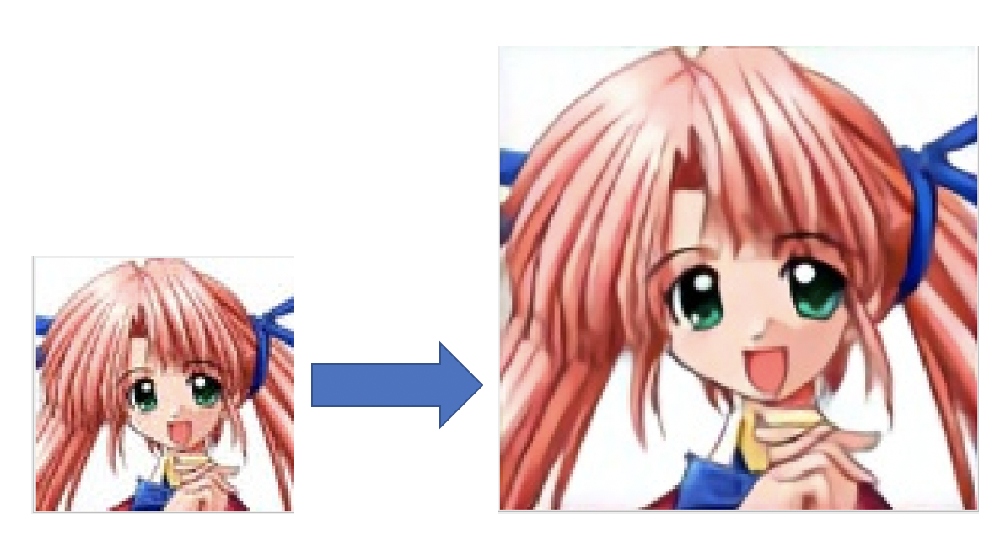

## waifu2x in tensorflow with python

### Effect

### Explain for this implement

1. The model weights are loaded from the official LUA implement https://github.com/nagadomi/waifu2x.

2. More weights and models can be got from https://github.com/nagadomi/waifu2x.

3. Thanks for the codes illustration from https://corochann.com/source-code-reading-of-waifu2x-865.html

4. The upscale rate is not exactly 2. After the upscaling, the image size will be 2*origin_size-4, because the padding pixels are removed from the output in default.

More latest AI informations come from AI PAPER FEED

